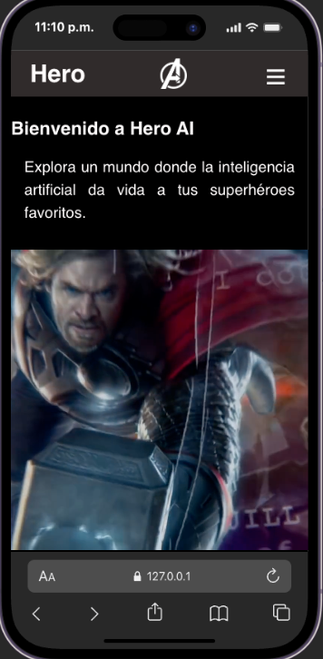
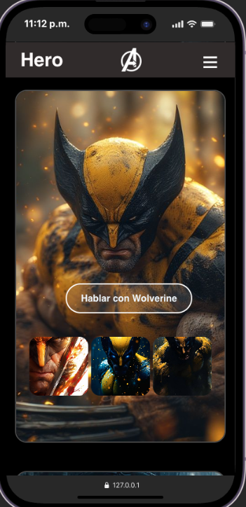
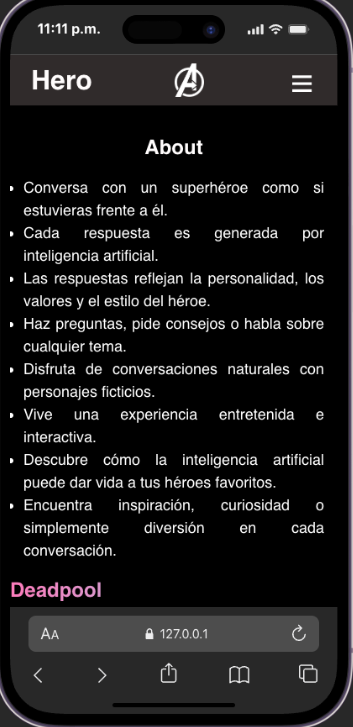

# Hero IA

SPA (Single Page Application) que permite conversar con **Deadpool**, un personaje ficticio del universo Marvel, mediante inteligencia artificial (Google Gemini). Incluye routing con History API, historial de conversación en sesión, y una serverless function que protege la API key.

🔗 **Aplicación desplegada:** https://project-root-mauve.vercel.app

---

## Personajes disponibles

La aplicación permite elegir entre tres personajes, cada uno con una personalidad propia definida mediante su propio system prompt enviado a Gemini (ver `api/characters.js`):

- **Deadpool** (Wade Wilson): sarcástico, irreverente, humor negro y espontáneo, capaz de romper la cuarta pared ocasionalmente. Bajo la fachada de payaso, muestra un lado más sincero y empático cuando la conversación lo requiere.
- **Wolverine**: tono más serio y de pocas palabras, con un carácter fuerte y directo.
- **Venom**: la voz del simbionte, con un tono más intenso y particular del personaje.

## Cómo se elige el personaje

1. Desde Home, cada personaje tiene su propia tarjeta con un botón ("Hablar con **Deadpool**", etc.) que lleva directo a su chat.
2. Dentro de la vista de Chat, hay un panel lateral con tarjetas pequeñas de los tres personajes, para cambiar de uno a otro sin volver a Home.
3. Al cambiar de personaje, la conversación se reinicia — cada chat empieza desde cero con el personaje seleccionado.

Esto se logra con una ruta dinámica en el router (`/chat/:character`, por ejemplo `/chat/deadpool`, `/chat/wolverine`, `/chat/venom`), que la aplicación interpreta del lado del cliente sin recargar la página.


---

## Requisitos

- [Node.js](https://nodejs.org/) (v18 o superior recomendado)
- [Vercel CLI](https://vercel.com/docs/cli) — se usa para simular las serverless functions en local
- Una API key de [Google AI Studio](https://aistudio.google.com/apikey) para Gemini

---

## Cómo ejecutar el proyecto en local

1. **Clonar el repositorio**
   ```bash
   git clone https://github.com/juandavid200010-wq/ComicSans-SPA.git
   cd ComicSans-SPA
   ```

2. **Instalar las dependencias**
   ```bash
   npm install
   ```

3. **Configurar las variables de entorno**

   Crea un archivo `.env` en la raíz del proyecto (puedes copiar `.env.example` como base):
   ```bash
   cp .env.example .env
   ```
   Y coloca tu API key real de Gemini:
   ```
   GEMINI_API_KEY=tu_api_key_real_aqui
   ```

4. **Instalar Vercel CLI (si no la tienes)**
   ```bash
   npm install -g vercel
   ```

5. **Ejecutar el proyecto**

   Este proyecto usa serverless functions (`/api`), por lo que **no funciona con servidores estáticos simples** (como Live Server). Es necesario levantarlo con Vercel CLI, que simula el entorno de producción localmente:
   ```bash
   vercel dev
   ```
   La primera vez te pedirá iniciar sesión y vincular el proyecto (puedes aceptar las opciones por defecto). Luego, abre la URL que te indique en la terminal (por ejemplo `http://localhost:3000`).

---

## Cómo ejecutar los tests

El proyecto incluye tests unitarios con [Vitest](https://vitest.dev/), enfocados en las funciones de transformación de datos (guardado de mensajes y formateo del historial para la API de Gemini).

```bash
npm test
```

Esto ejecuta todos los archivos dentro de la carpeta `tests/`.

---

## Cómo desplegar a Vercel

1. Instala Vercel CLI si aún no la tienes:
   ```bash
   npm install -g vercel
   ```

2. Inicia sesión (si es la primera vez):
   ```bash
   vercel login
   ```

3. Despliega a producción:
   ```bash
   vercel --prod
   ```

4. **Configura la variable de entorno en el dashboard de Vercel** (obligatorio, ya que el archivo `.env` local nunca se sube al repositorio):
   - Ve a tu proyecto en [vercel.com](https://vercel.com) → **Settings → Environment Variables**
   - Agrega `GEMINI_API_KEY` con tu key real, marcando el entorno de Production
   - Guarda y vuelve a ejecutar `vercel --prod` para que tome la nueva variable

---

## Capturas de pantalla

> _Agregar aquí capturas de las vistas Home, Chat (conversando con Deadpool) y About, tanto en mobile como en desktop._





---

## Registro del uso de IA en el proyecto

Durante el desarrollo se utilizó Claude (Anthropic) como asistente de programación, principalmente en las siguientes etapas:

- **Depuración de la conexión frontend-backend:** ayuda para diagnosticar y resolver errores de routing entre `src/chat.js` y `views/chat.js` (archivos duplicados y lógica desconectada del router).
- **Configuración de Vercel:** resolución de errores de despliegue relacionados con el script `build` faltante en `package.json` y la configuración del `outputDirectory` en `vercel.json`.
- **Diagnóstico de errores de la API de Gemini:** interpretación de errores devueltos por la API (API key inválida, cuota excedida, modelo `gemini-2.0-flash` retirado) y actualización al modelo vigente.
- **Redacción del *system prompt* de Deadpool:** iteración sobre tono, personalidad y reglas de consistencia del personaje.
- **Estructuración de tests unitarios:** separación de la lógica pura (manejo de datos) de la lógica de DOM, para permitir testear `addMessage` y `formatMessagesForGemini` con Vitest sin depender del navegador.

Las decisiones finales de arquitectura, nombres de variables, y el contenido del *system prompt* fueron revisadas y ajustadas por el desarrollador antes de integrarlas al proyecto